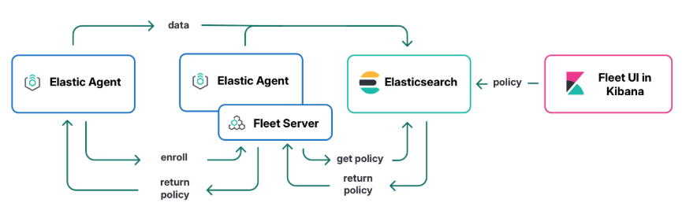

# Elastic Stack - Manual Deployment Guide




## Prerequisites

- Docker and Docker Compose installed
- `.env` file configured with all required variables
- Ports available: `9200`, `5601`, `8220`

## First-Time Deployment

### Step 1: Build images

```bash
docker compose -f elk-multi-node-cluster.yml build
docker compose -f fleet-compose.yml build
```

### Step 2: Start the core stack

```bash
docker compose -f elk-multi-node-cluster.yml up -d
```

Wait until all services are healthy:

```bash
docker ps --format "table {{.Names}}\t{{.Status}}"
```

All of `es-01`, `es-02`, `es-03`, and `kibana` must show `(healthy)` before proceeding.

### Step 3: Create the Fleet Server service token

This must be an API-based token (stored in the ES cluster, not a file), so it replicates across all nodes.

```bash
export ELASTIC_PASSWORD=$(grep ^ELASTIC_PASSWORD .env | cut -d= -f2)

CA_PATH=$(docker inspect es-01 --format='{{range .Mounts}}{{if eq .Destination "/usr/share/elasticsearch/config/certs"}}{{.Source}}{{end}}{{end}}')/ca/ca.crt

curl -sk -u elastic:${ELASTIC_PASSWORD} \
  --cacert $CA_PATH \
  -X POST "https://localhost:9200/_security/service/elastic/fleet-server/credential/token/fleet-token" \
  | python3 -m json.tool
```

Copy the `value` field from the output, then update `.env`:

```bash
sed -i '' "s/^FLEET_SERVER_SERVICE_TOKEN=.*/FLEET_SERVER_SERVICE_TOKEN=<token_value>/" .env
```

### Step 4: Get the Elastic Agent enrollment token

**Option A: via CLI**
```bash
docker exec kibana curl -sk \
  -u elastic:${ELASTIC_PASSWORD} \
  "https://kibana:5601/api/fleet/enrollment_api_keys" \
  -H "kbn-xsrf: true" \
  | python3 -m json.tool \
  | grep -B2 -A8 "general-agent-policy" \
  | grep "api_key"
```

Copy the value (format: `xxxxx:yyyyy`), then update `.env`:
```bash
sed -i '' "s/^ELASTIC_AGENT_ENROLLMENT_TOKEN=.*/ELASTIC_AGENT_ENROLLMENT_TOKEN=<token_value>/" .env
```

**Option B: via Kibana UI**

1. Go to `Fleet` → `Enrollment tokens`
2. Find the row with `Agent policy = General Agent Policy`
3. Click the eye icon to reveal the token
4. Copy and update `.env` manually


### Step 5: Start Fleet Server

```bash
docker compose -f fleet-compose.yml up -d fleet-server
```

Wait for healthy status:

```bash
until docker inspect fleet-server --format='{{.State.Health.Status}}' | grep -q healthy; do
  echo "Waiting..."; sleep 10
done && echo "Fleet Server is HEALTHY"
```

### Step 6: Start Elastic Agent

```bash
docker compose -f fleet-compose.yml up -d elastic-agent
```


## Redeployment (after changes or restart)

```bash
# Stop fleet services
docker compose -f fleet-compose.yml down

# Remove fleet-data volume (required on every redeploy)
docker volume rm fleet-data

# Rotate the service token
curl -sk -u elastic:${ELASTIC_PASSWORD} --cacert $CA_PATH \
  -X DELETE "https://localhost:9200/_security/service/elastic/fleet-server/credential/token/fleet-token" \
  | python3 -m json.tool

curl -sk -u elastic:${ELASTIC_PASSWORD} --cacert $CA_PATH \
  -X POST "https://localhost:9200/_security/service/elastic/fleet-server/credential/token/fleet-token" \
  | python3 -m json.tool

# Update .env, then redeploy
docker compose -f fleet-compose.yml up -d fleet-server
# Wait for healthy, then:
docker compose -f fleet-compose.yml up -d elastic-agent
```


## Full Stack Rebuild

```bash
docker compose -f fleet-compose.yml down
docker compose -f elk-multi-node-cluster.yml down

docker volume rm fleet-data

docker compose -f elk-multi-node-cluster.yml up -d --build
# Wait for all nodes and kibana to be healthy, then repeat Steps 3-6 above
docker compose -f fleet-compose.yml up -d --build fleet-server
# Wait for healthy
docker compose -f fleet-compose.yml up -d elastic-agent
```


## Scaling Elastic Agents

```bash
docker compose -f fleet-compose.yml up -d --scale elastic-agent=3
```


## Troubleshooting

### Check service health

```bash
docker ps --format "table {{.Names}}\t{{.Status}}"
```

### View errors only

```bash
# Fleet Server
docker logs fleet-server 2>&1 | grep '"log.level":"error"' | grep -v "timestamp_error" | tail -20

# Elastic Agent
docker logs $(docker ps -qf "name=elastic-fleet-elastic-agent") 2>&1 | grep -E "error|FAILED" | tail -20
```

### Verify service token is valid

```bash
# Check token exists and is cluster-wide (not file-based)
curl -sk -u elastic:${ELASTIC_PASSWORD} --cacert $CA_PATH \
  "https://localhost:9200/_security/service/elastic/fleet-server/credential" \
  | python3 -m json.tool
# tokens{} should be non-empty; file_tokens should be empty

# Test token auth directly
TOKEN=$(grep FLEET_SERVER_SERVICE_TOKEN .env | cut -d= -f2)
curl -sk --cacert $CA_PATH \
  -H "Authorization: Bearer $TOKEN" \
  "https://localhost:9200/_security/_authenticate" | python3 -m json.tool
```

### Clean up offline agents

```bash
docker exec kibana curl -sk -X POST \
  -u elastic:${ELASTIC_PASSWORD} \
  "https://kibana:5601/api/fleet/agents/bulk_unenroll" \
  -H "kbn-xsrf: true" \
  -H "Content-Type: application/json" \
  -d '{"agents": "status:offline", "revoke": true}'
```

### Check Elasticsearch cluster health

```bash
curl -sk -u elastic:${ELASTIC_PASSWORD} --cacert $CA_PATH \
  "https://localhost:9200/_cluster/health?pretty"
```


## Key Notes

- Always delete `fleet-data` volume before redeploying Fleet Server.
- Always use API-based service tokens, not file-based (`elasticsearch-service-tokens` CLI creates file-based tokens that only exist on one node and will cause 401 errors on a multi-node cluster).
- Elastic Agent must use `General Agent Policy` enrollment token, not the Fleet Server Policy token.
- Fleet Server must be `(healthy)` before starting Elastic Agent.