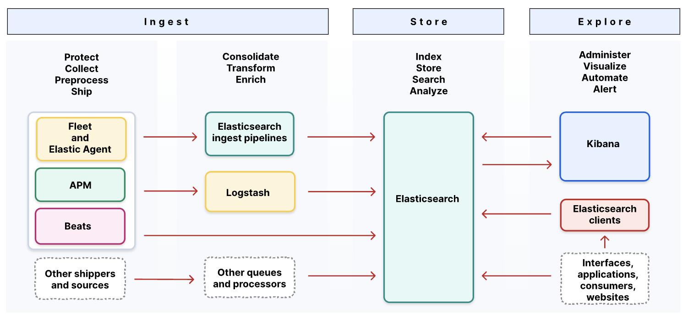

# Self-managed Elastic Stack

A production-ready, containerized Elastic Stack deployment with a 3-node Elasticsearch cluster, Kibana, Fleet Server, and Elastic Agent — all secured with TLS.




## Prerequisites

Before running the stack on a Linux host, configure the system for Elasticsearch:

```bash
# Required: raise virtual memory limit
sudo sysctl -w vm.max_map_count=262144

# Persist across reboots
echo "vm.max_map_count=262144" | sudo tee -a /etc/sysctl.conf
```

For a full production host setup (swap, file descriptors, memory lock, etc.):

```bash
sudo bash scripts/set_important_es_sysconfig.sh
```

An Ansible role is also available under `ansible/` for automated host configuration across multiple nodes.


## Stack Overview

### Services

| Service | Role |
|---|---|
| `es-01`, `es-02`, `es-03` | Elasticsearch data and master nodes, forming a 3-node cluster with cross-node replication |
| `kibana` | Web UI for search, dashboards, Fleet management, and index lifecycle configuration |
| `fleet-server` | Central control plane that manages Elastic Agent policies, enrollment, and health |
| `elastic-agent` | Deployed on monitored hosts; collects logs, metrics, and security events per Fleet policy |

### Compose files

| File | Purpose                                                                                                      |
|---|--------------------------------------------------------------------------------------------------------------|
| `elk-multi-node-cluster.yml` | **Core stack** — Elasticsearch (3 nodes) + Kibana + Logstash (optional). Use this in production.             |
| `fleet-compose.yml` | **Extensions** — Fleet Server + Elastic Agent. Runs on top of the core stack.                                |
| `elk-single-node-cluster.yml` | Single-node Elasticsearch + Kibana + Logstash (optional), security disabled. For local dev and testing only. |

The two production files are designed to be composed together: `elk-multi-node-cluster.yml` brings up the cluster, then `fleet-compose.yml` connects to it via the shared `elastic-net` network.


## Deployment

### Automated (recommended)

Copy and configure the environment file, then run the setup script:

```bash
cp .env.example .env
# Edit .env: set ELASTIC_PASSWORD, KIBANA_PASSWORD, and Kibana encryption keys

bash setup_elastic_stack.sh
```

The script handles all steps end-to-end: building images, waiting for health checks, creating the Fleet Server service token, fetching the agent enrollment token, and starting Fleet Server and Elastic Agent in the correct order.

**Options:**

```bash
bash setup_elastic_stack.sh --rebuild     # full teardown + rebuild
bash setup_elastic_stack.sh --fleet-only  # redeploy Fleet Server + Agent only
```

### Manual deployment

For a step-by-step walkthrough with explanations, see [DEPLOYMENT.md](DEPLOYMENT.md).

### Useful scripts

```bash
bash scripts/check_health.sh               # health check all services + verify token type
bash scripts/rotate_fleet_server_token.sh  # rotate the Fleet Server service token
bash scripts/get_agent_enrollment_token.sh # fetch and update agent enrollment token
bash scripts/cleanup_offline_agents.sh     # unenroll all offline agents
```

## Demo App and Audit Logs (in progress)

A FastAPI demo application (`demo-app/`) is included to generate structured application logs for testing the observability pipeline.

Planned configuration:
- Deploy `demo-app` via `backend-compose.yml`
- Nginx reverse proxy with structured access logs
- Elastic Agent configured with a custom audit log policy (see `assets/audit-logs/`)
- Ingest pipeline and ILM policy pre-defined in `assets/`

See [OBSERVABILITY_CHECKLIST.md](OBSERVABILITY_CHECKLIST.md) for current status.