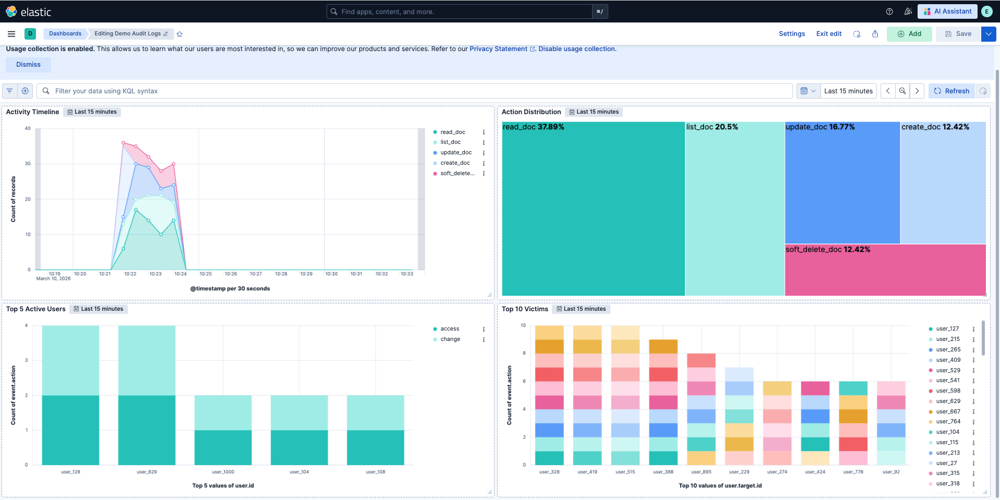

# Demo App — Document Management with Audit Logging

## Purpose

This application is a simple document management API built with FastAPI and MongoDB. Its primary goal is not the CRUD functionality itself, but to demonstrate how to implement structured audit logging for an observability pipeline.

Every write and read action performed through the API is recorded as an audit log event and shipped to Elasticsearch via Elastic Agent for analysis in Kibana.

### Scenario

The application models a shared document repository where any user can view, create, update, or delete any document — including documents owned by others. There is no access control by design. Instead, all actions are audited.

When a document is deleted, it is not removed from the database. It is soft-deleted: marked with `is_deleted: true` and retained in MongoDB. The GET endpoint supports filtering to list only documents owned by a specific user, or to include soft-deleted ones.

The audit logs are designed to answer the classic 5W1H questions:

| Question | Field |
|---|---|
| Who | `user.id` |
| What | `event.action` |
| When | `@timestamp` |
| Where | `source.ip` |
| How | `http.request.method` / `event.type` |


## API Endpoints

| Method | Endpoint | Action |
|---|---|---|
| POST | /documents | Create document |
| GET | /documents | List documents |
| PUT | /documents/{id} | Update document |
| DELETE | /documents/{id} | Soft-delete document |


## Audit Log Schema

Audit logs follow the [Elastic Common Schema (ECS)](https://www.elastic.co/guide/en/ecs/current/index.html) format and are written to a JSON file by the application. The Elastic Agent picks up the file and ships the events to Elasticsearch.

### Example Event

```json
{
  "@timestamp": "2026-03-07T10:00:21Z",
  "event": {
    "action": "create_doc",
    "category": ["database", "web"],
    "type": ["access", "change"],
    "outcome": "success"
  },
  "user": {
    "id": "cuong"
  },
  "source": {
    "ip": "172.18.0.1"
  },
  "http": {
    "request": {
      "method": "POST"
    }
  },
  "url": {
    "path": "/documents"
  },
  "user_agent": {
    "original": "Mozilla/5.0 ..."
  },
  "service": {
    "name": "document-api"
  },
  "resource": {
    "id": "65f1a9c8e3b2d4a1f0c7e892",
    "type": "document",
    "name": "Project Roadmap"
  },
  "labels": {
    "is_deleted": false
  }
}
```

### Cross-User Action

When a user modifies or deletes a document they do not own, the `user.target` field is populated to track the affected owner:

```json
{
  "user": {
    "id": "alice",
    "target": {
      "id": "bob"
    }
  }
}
```

### Field Reference

| Field | Type | Description |
|---|---|---|
| `@timestamp` | date | Time the event occurred (UTC) |
| `event.action` | keyword | Action name: `create_doc`, `read_doc`, `update_doc`, `list_doc`, `soft_delete_doc` |
| `event.category` | keyword | ECS category array: `database`, `web` |
| `event.type` | keyword | ECS type array: `access`, `change` |
| `event.outcome` | keyword | Result of the action: `success` or `failure` |
| `user.id` | keyword | The user performing the action |
| `user.target.id` | keyword | The document owner (only when acting on another user's document) |
| `source.ip` | ip | Client IP, resolved through Nginx `X-Forwarded-For` |
| `http.request.method` | keyword | HTTP method used |
| `url.path` | keyword | API path |
| `service.name` | keyword | Always `document-api` |
| `resource.id` | keyword | MongoDB ObjectId of the affected document |
| `resource.type` | keyword | Always `document` |
| `resource.name` | keyword | Title of the affected document |
| `labels.is_deleted` | boolean | Soft-delete state of the document at the time the event was recorded |


## Log File Location

Each application container instance writes its audit logs to a dedicated file to avoid write conflicts when scaling horizontally:

```
/var/log/demo-app/logs_audit_<hostname>.json
```

The log directory is mounted as a shared Docker volume (`app-logs`) so the Elastic Agent container can read and ship the files to Elasticsearch.

To create the volume before starting the stack:

```bash
docker volume create app-logs
```


## Further Reading

- For setup instructions (start backend, apply templates, configure Kibana integration): [docs/AUDIT_LOGS_SETUP.md](../docs/AUDIT_LOGS_SETUP.md)
- For Elasticsearch index design, ILM policy, and ingest pipeline rationale: [assets/README.md](../assets/README.md)

## Demo Audit Logs Dashboard

